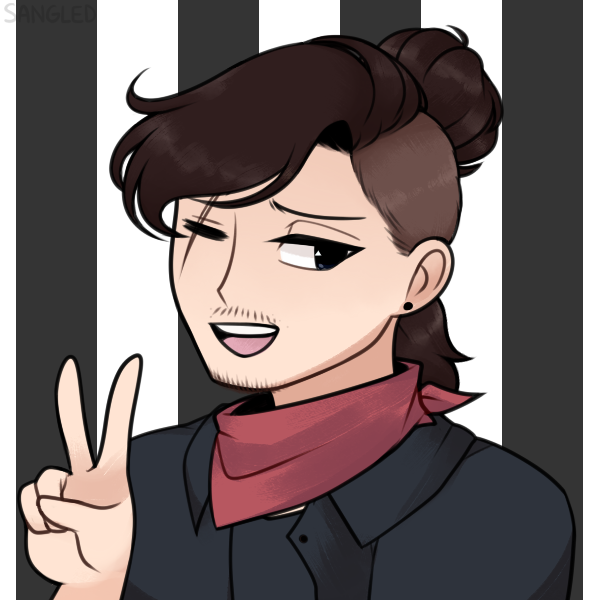

### Hello everyone ╰(*°▽°*)╯ 

   
<!--
**zulatto/zulatto** is a ✨ _special_ ✨ repository because its `README.md` (this file) appears on your GitHub profile.

Here are some ideas to get you started:

- 🔭 I’m currently working on ...
- 🌱 I’m currently learning ...
- 👯 I’m looking to collaborate on ...
- 🤔 I’m looking for help with ...
- 💬 Ask me about ...
- 📫 How to reach me: ...
- 😄 Pronouns: ...
- ⚡ Fun fact: ...
-->

 

  <a href="https://github.com/zulatto">
  
  

 ---
  
### :hammer_and_wrench: Languages

 
  
  
  
  
  
  
  

---

### :books: I’m currently learning:
  

 
  
  
  
  
  

  

---

### 🔗 My social networks

  
 
  
  
  
   
  
   

  

 
